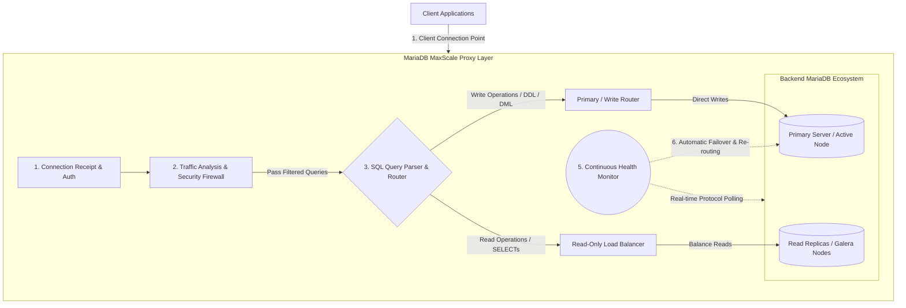
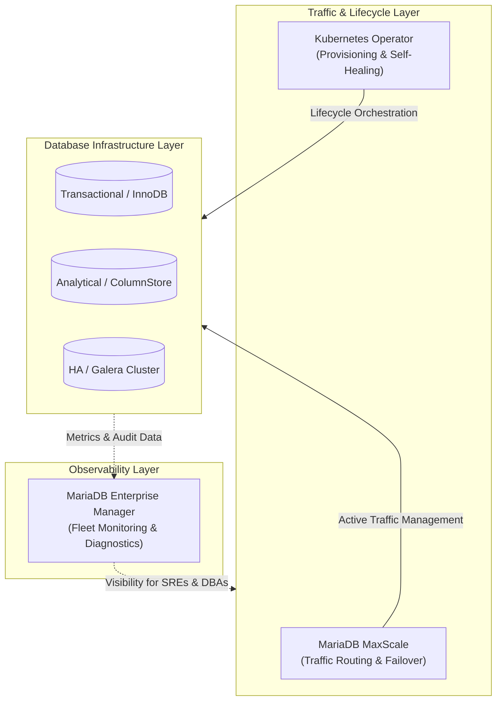

Tools & Proxies 

MariaDB MAxScale
MariaDB MaxScale is an advanced database proxy, intelligent query router, and load balancer designed to sit between client applications and backend MariaDB servers.

## Traffic Flow Diagram

# MaxScale Core Objectives ("Max Goal")

The primary objective of MariaDB MaxScale is to simplify application development and database administration by providing a single, intelligent entry point for complex database topologies.

## Core Goals & Capabilities

* **Continuous High Availability**  
  Ensures mission-critical applications remain accessible during hardware failures or routine maintenance through automated failover and cluster reconfiguration.

* **Elastic Scalability**  
  Enables scaling read and write operations across multiple nodes without requiring any changes to application code.

* **Hardened Security**  
  Serves as a centralized security layer that protects the entire database fleet using database firewalls and query filtering.

* **Operational Validation**  
  Facilitates safe database upgrades and troubleshooting using tools like Workload Capture and Replay (WCAR) and the Diff Router to compare server behavior across versions.

# MariaDB Enterprise Manager Overview

MariaDB Enterprise Manager is a fleet-wide management and observability solution within the MariaDB Enterprise Platform. It acts as a single-pane-of-glass interface to monitor transactional, analytical, and hybrid workloads across an enterprise's entire database infrastructure.

---

## Strategic Role Across Tools & Proxies

* **Enterprise Manager (Observability):** Monitors overall health, query performance, and operational diagnostics across all clusters and instances.
* **MaxScale (Traffic Management):** Acts as an active proxy layer handling query routing, load balancing, and failover.
* **Kubernetes Operator (Automation):** Automates containerized lifecycle tasks like provisioning, scaling, and self-healing.

---

## Operational Workflow

